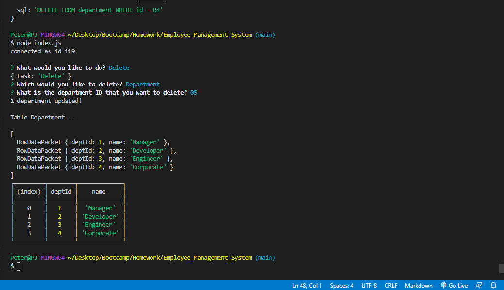

# Employee Management System

## Description: 
Tasked with providing a database of employees and utiilizing a command line interface to navigate all employee data, we utilized javascript, mysql, as well as the inquirer npm to provide an intuitive and effective system which allows the user to accomplish all tasks outlined for us.
## Table of Contents

-[Description](#description)

-[Installation](#installation)

-[Instructions](#instructions)

-[Licenses](#licenses)

-[Deployed](#deployed)

-[Contact](#contact)

-[Contributors](#Contributors)

-[Testing](#Tests)

## Installation:
Utilizing the code available through the owners github page (linked below) as well as installing the attached dependancies.
## Instructions:
You will be prompted as to what you want to accomplish with the app. After selecting what actions you would like to perform, you will be provided with both a data object and a table of the current data.
### Licenses: 

### Deployed: 
[https://github.com/boylepeter/Employee_Management_System](https://github.com/boylepeter/Employee_Management_System)

[Video of basic function](https://drive.google.com/file/d/1NAgUrQaHKsDZ95ybdDb6IVoVFvpi6bNR/view)

[Video of bonus function](https://drive.google.com/file/d/1D0bv6TzOCIXh_wNO9mM3WeSy6H9XzjgI/view)

### Contact:

[Github](https://github.com/boylepeter)

[LinkedIn](https://www.linkedin.com/in/peter-boyle-22b5071b7/)

Email: [Boyle.Peter614@gmail.com](Boyle.Peter614@gmail.com)

### Contributors: 
None

### Tests: 
Please feel free to try the application for yourself. The instructions for use and installation can be found above.
